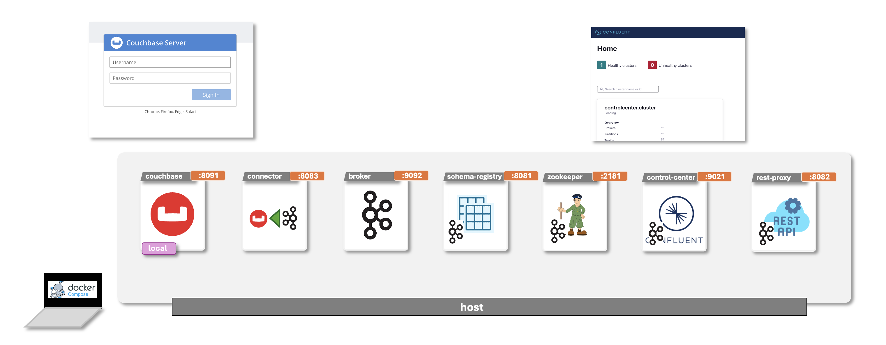
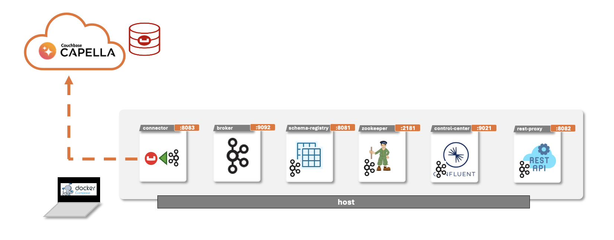
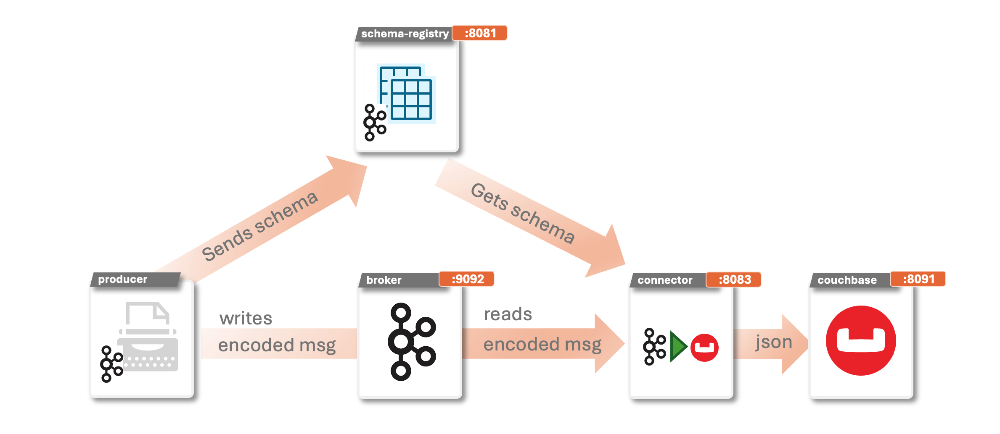
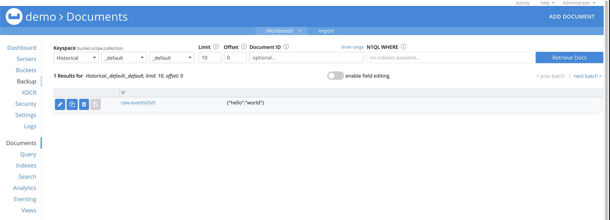

# quickstart-couchbase-kafka-connector

Docker Compose quick development starting kit for deploying Couchbase + Confluent Kafka Platform and Distributed Couchbase Kafka Connector

## Quick start with Kafka Confluent and local Couchbase instance


```
docker-compose up
```

Then, verify:

* Couchbase is UP: [http://localhost:8091](http://localhost:8091) user: `Administrator` password: `password`
* **Historical** bucket
* sink-user user with application role on Historical bucket
* Checking Kafka Confluent platform is UP: [http://localhost:9021](http://localhost:9021)
* `raw-events` topic
* Couchbase-Sink-Connector sink connector running


## Quick start with Kafka Confluent and Couchbase Capella



### Pre-requisites

1. Create a Capella Cluster and the target Bucket/Scope/Collection 
2. Create a Capella Access User with write and read permissions in that collection
3. Allow the ip address connectivity between your local environment and Capella cluster
4. Download the Capella cluster `couchbase.pem` certificate into the `./cert` folder

### Configuring Capella connection credentials into the connector

   1. Mapping `/cert` folder into the connector container volume `/data/cert` folder

```
  connect:       
    …
    volumes:
      - $PWD/data:/data
      - $PWD/cert:/data/cert
```

   2. Connect to Couchbase Capella using Secure connections and credentials properties

        - `couchbase.seed.nodes`
        - `couchbase.enable.tls`
        - `couchbase.trust.certificate.path`
        - `couchbase.enable.hostname.verification` 

```
  connect:
    …
    command:
        …
        echo -e "\n--\n+> Creating Couchbase Sink Connector"
        curl -s -X PUT -H  "Content-Type:application/json" http://localhost:8083/connectors/sink-couchbase-01/config \
            -d '{    
                  …
                  "topics": "raw-events",
                  "couchbase.seed.nodes": "couchbases://cb.bkfkly8znvcg2vtp.cloud.couchbase.com",
                  "couchbase.bootstrap.timeout": "20s",
                  "couchbase.bucket": "demo",
                  "couchbase.username": "myuser",
                  "couchbase.password": "Passw0rd!",
                  "couchbase.enable.hostname.verification": "false",
                  "couchbase.enable.tls": "true",
                  "couchbase.trust.certificate.path": "/data/cert/couchbase.pem",
                  …
        }'
        …
```

   3. Optional - you can skip the local couchbase container creation. If you want to remove/comment this couchbase image do not forget to remove it also from the dependencies from the connect container.  

## Encoders/Decoders
Kafka messages are organized into topics. Each message is a key/value, but that is all that Kafka requires. Both key and value are just bytes when they are stored in Kafka. This makes Kafka applicable to a wide range of use cases, but it also means that developers have the responsibility of deciding how to serialize the data.

In configuring Kafka Connect, one of the key things to standardize on is the serialization format. You need to make sure that anyone reading from the topic is using the same serialization format as those writing to the topic. Otherwise, confusion and errors will ensue!

When working with encoded messages, the consumer must use the same schema when decoding a message that the producer used when encoding it. This could lead to difficulties in coordinating which schema was used for a given message.

To solve this problem, Kafka offers the Schema Registry, which allows you to specify the schema used to identify which schema was used for a message. The producer embeds a schema ID into the message itself, which the consumer can then look up in the registry and retrieve the exact scheme.



There are various serialization formats with common ones including:

* JSON
* Avro
* Protobuf
* String delimited (e.g., CSV)

There are advantages and disadvantages to each of these—well, except delimited, in which case it’s only disadvantages 

**If I write to my target in JSON, must I use JSON for my topics?**
No, not at all. The format in which you’re reading data from a source, or writing it to an external data store, doesn’t need to have a bearing on the format you use to serialize your messages in Kafka.

A connector in Kafka Connect is responsible for taking the data from the source data store (for example, a database) and passing it as an internal representation of the data to the converter. Kafka Connect’s converters then serialize this source data object onto the topic.

The same happens in reverse when using Kafka Connect as a sink—the converter deserializes the data from the topic into this internal representation, which is passed to the connector to write to the target data store using the appropriate method specific to the target.

What this means is that you can have data on a topic in Avro (for example), and when you come to write it to HDFS (for example), you simply specify that you want the sink connector to use that format.

Remember, Kafka messages are just pairs of key/value bytes, and you need to specify the converter for both keys and value, using the key.converter and value.converter configuration setting. In some situations, you may use different converters for the key and the value.

You can find more details in the following blog documentation link: [converters details](https://www.confluent.io/blog/kafka-connect-deep-dive-converters-serialization-explained/)

### Setup SinkConnector with Json Converter
 For JSON, you need to specify if you want Kafka Connect to embed the schema in the JSON itself. When you specify converter-specific configurations, always use the key.converter. or value.converter. prefix. For example, to use JSON for the message payload, you’d specify the following:

  - `key.converter`
  - `value.converter`

```console
connect:
    image: confluentinc/cp-kafka-connect-base:latest
    hostname: connect
    container_name: connect
    depends_on:
      - broker
      - schema-registry
      - couchbase
    ports:
      - "8083:8083"
    environment:
      ...
      CONNECT_KEY_CONVERTER: org.apache.kafka.connect.storage.StringConverter
      CONNECT_VALUE_CONVERTER: org.apache.kafka.connect.json.JsonConverter
      ...
  connect:
    …
    command:
        …
        echo -e "\n--\n+> Creating Couchbase Sink Connector"
        curl -s -X PUT -H  "Content-Type:application/json" http://localhost:8083/connectors/sink-couchbase-01/config \
            -d '{
                  …
                  "topics": "raw-events",
                  …
        }'
        …
```

### Setup Sink Connector with Avro Converter

For Avro, you need to specify the Schema Registry.When you specify converter-specific configurations, always use the key.converter. or value.converter. prefix. For example, to use Avro for the message payload, you’d specify the following:
        
  - `key.converter`
  - `value.converter`
  - `value.converter.schemas.enable`
  - `value.converter.schema.registry.url`


```console
connect:
    ...
    environment:
      ...
      CONNECT_KEY_CONVERTER: org.apache.kafka.connect.storage.StringConverter
      CONNECT_VALUE_CONVERTER: io.confluent.connect.avro.AvroConverter
      CONNECT_VALUE_CONVERTER_SCHEMA_REGISTRY_URL: 'http://schema-registry:8081'
      ...
  connect:
    …
    command:
        …
        echo -e "\n--\n+> Creating Couchbase Sink Connector"
        curl -s -X PUT -H  "Content-Type:application/json" http://localhost:8083/connectors/sink-couchbase-01/config \
            -d '{
                  …
                  "topics": "raw-events",
                  …
        }'
        …
```


### Ingesting Json Documents

TBD 

```console 
```

### Ingesting Avro Data

When working with encoded messages, the consumer must use the same schema when decoding a message that the producer used when encoding it. This could lead to difficulties in coordinating which schema was used for a given message.

To solve this problem, Kafka offers the Schema Registry, which allows you to specify the schema used to identify which schema was used for a message. The producer embeds a schema ID into the message itself, which the consumer can then look up in the registry and retrieve the exact scheme.


#### Kafka Avro Console Producer
 Writing a test application just to send messages to the cluster and display the results would be tedious. It’s much easier to hop on the terminal and see what’s going on interactively. Let’s imagine you have deployed an Apache cluster and are using Avro to serialize data and lighten network overhead. How can we check that our Avro setup works as expected?

 First, let’s send the message using the Kafka console Avro producer.

```console
docker exec -it schema-registry /usr/bin/kafka-avro-console-producer \
  --bootstrap-server broker:29092 \
  --topic raw-events \
  --property value.schema='{"type":"record","name":"random_record","fields":[{"name":"hello","type":"string"}]}'
```
Then introduce the json document to be ingested, one per line as many you want and to exit push `Ctrl+C`: 

```console
{"hello": "world"}
```

You can verify the created document in your Couchbase Cluster:



##### Troubleshooting
Note: check out the charset and hiden characters when you copy/paste directly from this README. If you see an error like this one, try again typing it manually instead of copy/paste it:

```
org.apache.kafka.common.errors.SerializationException: Error deserializing json {�2"hello":�"world"} to Avro of schema {"type":"record","name":"random_record","fields":[{"name":"hello","type":"string"}]}
	at io.confluent.kafka.formatter.AvroMessageReader.readFrom(AvroMessageReader.java:127)
	at io.confluent.kafka.formatter.SchemaMessageReader.readMessage(SchemaMessageReader.java:405)
``` 

#### Java Random AVRO Generator Application Sample
  You can find a java random AVRO generator producer in the github [https://github.com/couchbaselabs/springboot-kafka-avro-producer](https://github.com/couchbaselabs/springboot-kafka-avro-producer) repository. By default, the AVRO Kafka Producer demo is using `src/main/resources/avro-schemas/OrderValue.avsc` avro schema to produce 20K documents into the Kafka localhost `raw-events` topic.

```console
mvn spring-boot:run -Dspring-boot.run.arguments=-s=OrderValue
```

##### Troubleshooting

Note: Use a different kafka topic than our previous example. Alternatively, restart & cleanup the environment or schema registry for raw-events topic. By default, your topic matches with a single schema. If you run this example right after the kafka avro console producer you can see the following error:

```
Caused by: org.apache.kafka.common.errors.InvalidConfigurationException: Schema being registered is incompatible with an earlier schema for subject "raw-events-value", details: [{errorType:'NAME_MISMATCH', description:'The name of the schema has changed (path '/name')', additionalInfo:'expected: random_record'}, {errorType:'READER_FIELD_MISSING_DEFAULT_VALUE', description:'The field 'orderID' at path '/fields/0' in the new schema has no default value and is missing in the old schema', additionalInfo:'orderID'}, {errorType:'TYPE_MISMATCH', description:'The type (path '/fields/1/type') of a field in the new schema does not match with the old schema', additionalInfo:'reader type: ENUM not compatible with writer type: RECORD'}, {errorType:'TYPE_MISMATCH', description:'The type (path '/fields/3/type') of a field in the new schema does not match with the old schema', additionalInfo:'reader type: ENUM not compatible with writer type: RECORD'}, {errorType:'READER_FIELD_MISSING_DEFAULT_VALUE', description:'The field 'isOrderPaid' at path '/fields/4' in the new schema has no default value and is missing in the old schema', additionalInfo:'isOrderPaid'}, {errorType:'READER_FIELD_MISSING_DEFAULT_VALUE', description:'The field 'totalCost' at path '/fields/5' in the new schema has no default value and is missing in the old schema', additionalInfo:'totalCost'}, {errorType:'READER_FIELD_MISSING_DEFAULT_VALUE', description:'The field 'orderItems' at path '/fields/6' in the new schema has no default value and is missing in the old schema', additionalInfo:'orderItems'}, {oldSchemaVersion: 1}, {oldSchema: '{"type":"record","name":"random_record","fields":[{"name":"hello","type":"string"}]}'}, {compatibility: 'BACKWARD'}]; error code: 409
```

## References

* [https://www.redpanda.com/guides/kafka-tutorial-kafka-console-producer](https://www.redpanda.com/guides/kafka-tutorial-kafka-console-producer)
* [https://www.confluent.io/blog/kafka-connect-deep-dive-converters-serialization-explained/](https://www.confluent.io/blog/kafka-connect-deep-dive-converters-serialization-explained/)
